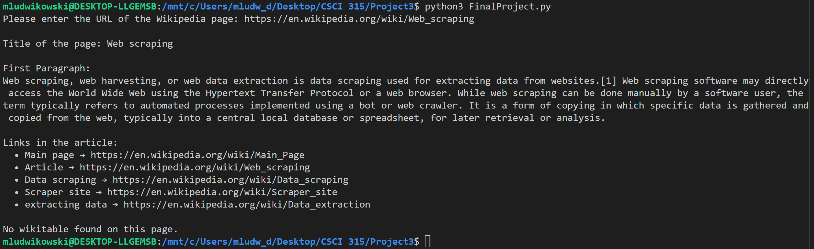

Portfolio
=========

Programming Projects
--------------------

*For access to my private project repositories, please [email me](mailto:MRLudwikowski@csustudent.net?subject=GitHub%20Access) with the subject line, GitHub Access.

---
### [Name and ID parcer | CSCI 315](project1.md)

---
### [Hangman | CSCI 235](project2.md)

---
### [Wikipedia parcer | CSCI 301](project3.md)

---
### [Go-Fish project | CSCI 325](project4.md)

---

Ethics Papers
-------------

### [Ethics Behind Copying Others Code](pdf/Michael%20Ludwikowski%20Survey%20of%20Survey%20Scripting%20Languages%20Ethics%20paper.pdf)

-   **Class: CSCI 301, Survey of Scripting Languages**  
-   **Grade: 100%**

### [Software Testing](/pdf/Michael%20Ludwikowski%20Ethics%20Paper%20Software%20Testing.pdf)

-   **Class: CSCI 315, Data Structure Analysis** 
-   **Grade: 100%**

### [Coding Ethics in the Workplace](/pdf/Michael%20Ludwikowski%20Ethics%20paper%20coding%20ethics%20in%20the%20workspace.pdf)

-   **Class: CSCI 325, Object-Oriented Programming** 
-   **Grade: 85%**

---

Presentations
-------------

### [Canbus Presentation](/pdf/Canbus%20assignment.mkv)

- **Class: CSCI 332, Applied Networking** 
- **Grade: 100%**

### [Go-fish Implamentation guide](/pdf/uml%20diagram.pptx)

- **Class: CSCI 325, Object-Oriented Programming** 
- **Grade: 70%**

<!-- Remove above link if you don't want to attributive -->
