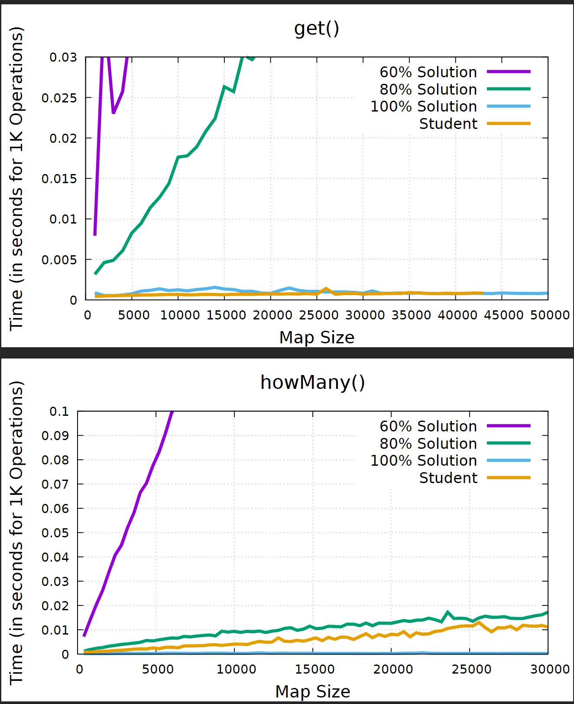
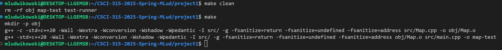

[Back to Portfolio](./)

Name and ID parcer
===============

-   **Class: CSCI 315, Data Structure Analysis** 
-   **Grade: 85%** 
-   **Language(s): C++** 
-   **Source Code Repository:** [Name and ID Parcer](https://github.com/MichaelLudwikowski/MichaelLudwikowski_CSCI_SPP_project1/tree/main)  
    (Please [email me](mailto:MRLudwikowski@csustudent.net?subject=GitHub%20Access) to request access.)

## Project description

Stores and searches key-value pairs utilizing simple and complext data structures. Creates a map of a students first and last name to an ID. In other words, maps a string to an integer. 

## How to compile and run the program

This program uses WSL to compile and run the code. 

```bash
make clear
make all
```

## UI Design

The code should run without error and should finish on its own (Fig 1). You can also try running the make clean command to reset the program. In the program you should also see the performance statistics to display how using the data structures allows for the program to run swiftly and efficiency while being accurate at the same time. (Fig 2)

  
Fig 1. The launch screen

  
Fig 2. Example output after input is processed.

## 3. Additional Considerations

Has a predetermined set of first and last names that only use the 26 letters from the english alphabet. 

[Back to Portfolio](./)
