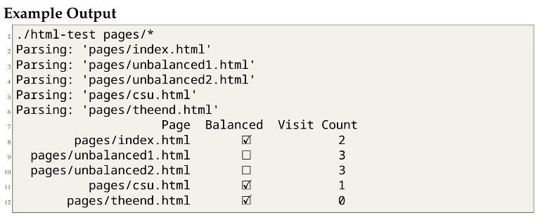

[Back to Portfolio](./)

Website parcer
===============

-   **Class: CSCI 315** 
-   **Grade: 80%** 
-   **Language(s): C++** 
-   **Source Code Repository:** [Website parcer](https://github.com/MichaelLudwikowski/MichaelLudwikowski_CSCI_SPP_project2/tree/main)  
    (Please [email me](mailto:MRLudwikowski@csustudent.net?subject=GitHub%20Access) to request access.)

## Project description

Utilises different data structures to run tests through different HTML websites to check if it is parced as well as how many other websites it can get to from it's own.

## How to compile and run the program

How to compile (if applicable) and run the project.

```bash
Make clean
Make all
optional: make example-test.cpp
```

## UI Design

Very simple to run, just do "make all" and it will run through the sameple websites put in the "pages" folder to check if they are balanced and other sites to visit. If you want you can add optional tests and/or add more pages to test.

  
Fig 1. Example Output

## Additional Considerations

Runs on more simple HTML pages and nothing large scale just yet. 

[Back to Portfolio](./)
