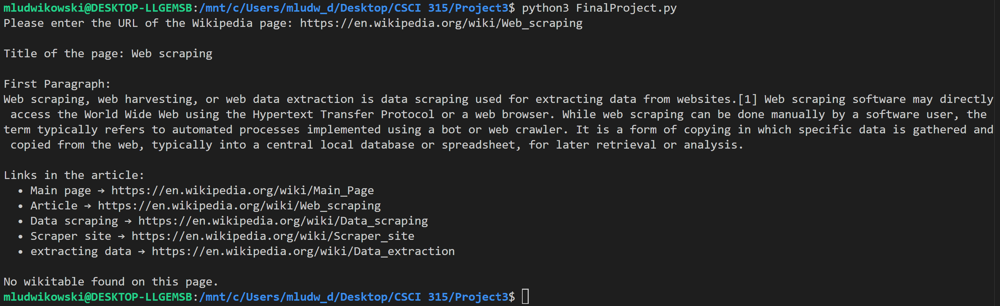

[Back to Portfolio](./)

Wikipedia Parcer
===============

-   **Class: CSCI 301, Survey of Scripting languages** 
-   **Grade: 100%** 
-   **Language(s): Python** 
-   **Source Code Repository:** [FinalProject3](FinalProject3)  
    (Please [email me](mailto:MRLudwikowski@csustudent.net?subject=GitHub%20Access) to request access.)

## Project description

Goes to the wikipedia page given and gets the first paragraph summary along with related pages and table if there is one. 

## How to compile and run the program

```bash
On Ubuntu or WSL: 
sudo apt update
sudo apt install python3 python3-pip
pip install requests beutifulsoup pandas

python3 FinalProject3.py
```

## UI Design

The code simply asks the user for the URL of the page wanted and outputs the rest of the page.

  
Fig 1. Example of the code running with Wikipedia URL

## 3. Additional Considerations

The program requires some additional instalations, which can be difficult if you are not on Ubuntu or don't have a machine that can run a WSL environment. Even after, there are some extentions needed to run the parcing code. 

[Back to Portfolio](./)
