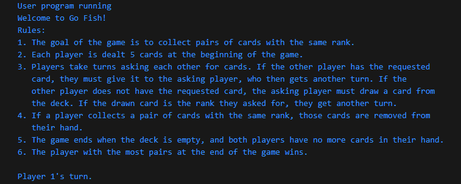
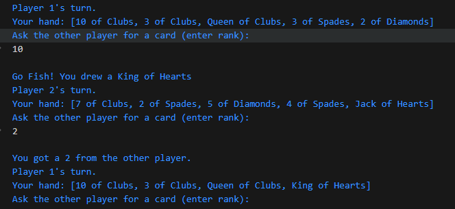

[Back to Portfolio](./)

Go Fish Game
===============

-   **Class: CSCI 330** 
-   **Grade: 70%** 
-   **Language(s): Java** 
-   **Source Code Repository:** [Go Fish Game](https://github.com/MichaelLudwikowski/MichaelLudwikowski_CSCI_SPP_project4/tree/main)  
    (Please [email me](mailto:MRLudwikowski@csustudent.net?subject=GitHub%20Access) to request access.)

## Project description

Fully functional implamentation of the card game Go Fish in Java. Consists and focuses on classes that handle the card deck, player interactions, and gameplay. Involves 2 user players that go back and forth playing the game. The directions for the game are displayed at the start.

## How to compile and run the program

Install or have a Java Development Kit (JDK) that can be found from microsoft

```bash
Compile with javac GoFishGame.java
Run with java GoFishGame
```

## UI Design

First displays the rules and task of the game with how to play (Fig. 1). Afterwards, the game goes right into player 1s turn and alternates between players (Fig. 2).

  
Fig 1. The launch screen

  
Fig 2. Example output after input is processed.

##Additional Considerations

The program assumes valid input from the user with little error handling. 

[Back to Portfolio](./)
